# Citary Database ERD

Este diagrama muestra todas las 37 tablas de la base de datos del sistema de gestión de restaurantes.

```mermaid
erDiagram
    %% Core Schema - 11 tables
    core_country {
        serial cou_id PK
        varchar(50) cou_name
        varchar(10) cou_code
        varchar(10) cou_prefix
        timestamp cou_created_date
        varchar(1) cou_record_status
    }
    
    core_province {
        serial pro_id PK
        varchar(50) pro_name
        varchar(10) pro_code
        varchar(10) pro_prefix
        timestamp pro_created_date
        varchar(1) pro_record_status
        int id_country FK
    }
    
    core_city {
        serial cit_id PK
        varchar(50) cit_name
        timestamp cit_created_date
        varchar(1) cit_record_status
        int id_province FK
        int id_country FK
    }
    
    core_user {
        serial use_id PK
        varchar(50) use_name
        varchar(50) use_last_name
        varchar(100) use_email
        varchar(100) use_password
        varchar(60) use_token
        timestamp use_created_date
        varchar(1) use_record_status
        varchar(100) use_google_id
    }
    
    core_role {
        serial rol_id PK
        varchar(50) rol_name
        varchar(200) rol_description
        timestamp rol_created_date
        varchar(1) rol_record_status
    }
    
    core_user_role {
        serial uro_id PK
        timestamp uro_created_date
        varchar(1) uro_record_status
        int id_user FK
        int id_role FK
    }
    
    core_genre {
        serial gen_id PK
        varchar(50) gen_name
        varchar(100) gen_description
        varchar(10) gen_abbreviation
        timestamp gen_created_date
        varchar(1) gen_record_status
    }
    
    core_identification_type {
        serial ity_id PK
        varchar(50) ity_name
        varchar(100) ity_description
        varchar(10) ity_abbreviation
        timestamp ity_created_date
        varchar(1) ity_record_status
        int id_country FK
    }
    
    core_phone_type {
        serial pty_id PK
        varchar(50) pty_name
        varchar(100) pty_description
        timestamp pty_created_date
        varchar(1) pty_record_status
    }
    
    core_notification_type {
        serial nty_id PK
        varchar(50) nty_name
        varchar(100) nty_description
        timestamp nty_created_date
        varchar(1) nty_record_status
    }
    
    core_sessions {
        serial ses_id PK
        varchar(200) ses_jwt
        int id_user FK
        timestamp ses_created_date
        timestamp ses_expires_at
        varchar(200) ses_ip
        varchar(255) ses_user_agent
    }
    
    %% Data Schema - 26 tables
    data_person {
        serial per_id PK
        varchar(20) per_identification_number
        varchar(50) per_first_name
        varchar(50) per_second_name
        varchar(50) per_first_last_name
        varchar(50) per_second_last_name
        varchar(100) per_occupation
        timestamp per_created_date
        varchar(1) per_record_status
        int id_identification_type FK
        int id_genre FK
        int id_user FK
    }
    
    data_phone {
        serial pho_id PK
        varchar(13) pho_number
        timestamp pho_created_date
        varchar(1) pho_record_status
        int id_person FK
        int id_phone_type FK
    }
    
    data_address_type {
        serial aty_id PK
        varchar(100) aty_name
        varchar(100) aty_description
        timestamp aty_created_date
        varchar(1) aty_record_status
    }
    
    data_address {
        serial add_id PK
        varchar(150) add_main_street
        varchar(100) add_secondary_street
        varchar(20) add_postal_code
        varchar(150) add_reference
        varchar(10) add_number
        timestamp add_created_date
        varchar(1) add_record_status
        int id_country FK
        int id_province FK
        int id_city FK
        int id_person FK
        int id_address_type FK
    }
    
    data_restaurant {
        serial res_id PK
        varchar(200) res_name
        varchar(200) res_business_name
        varchar(13) res_ruc
        varchar(100) res_email
        varchar(13) res_phone
        varchar(200) res_website
        varchar(300) res_logo_url
        text res_description
        jsonb res_opening_hours
        numeric res_tax_percentage
        timestamp res_created_date
        varchar(1) res_record_status
        int id_owner FK
        int id_address FK
    }
    
    data_restaurant_employee {
        serial rem_id PK
        varchar(100) rem_position
        numeric rem_salary
        date rem_hire_date
        timestamp rem_created_date
        varchar(1) rem_record_status
        int id_restaurant FK
        int id_person FK
    }
    
    data_zone {
        serial zon_id PK
        varchar(100) zon_name
        varchar(200) zon_description
        int zon_capacity
        timestamp zon_created_date
        varchar(1) zon_record_status
        int id_restaurant FK
    }
    
    data_table {
        serial tab_id PK
        varchar(20) tab_number
        int tab_capacity
        varchar(200) tab_qr_code
        varchar(20) tab_status
        timestamp tab_created_date
        varchar(1) tab_record_status
        int id_restaurant FK
        int id_zone FK
    }
    
    data_unit_measure {
        serial uni_id PK
        varchar(50) uni_name
        varchar(10) uni_abbreviation
        varchar(20) uni_type
        timestamp uni_created_date
        varchar(1) uni_record_status
    }
    
    data_supplier {
        serial sup_id PK
        varchar(200) sup_name
        varchar(100) sup_contact_name
        varchar(13) sup_phone
        varchar(100) sup_email
        varchar(13) sup_ruc
        timestamp sup_created_date
        varchar(1) sup_record_status
        int id_restaurant FK
        int id_address FK
    }
    
    data_ingredient {
        serial ing_id PK
        varchar(200) ing_name
        text ing_description
        numeric ing_current_stock
        numeric ing_minimum_stock
        numeric ing_maximum_stock
        numeric ing_cost_per_unit
        timestamp ing_created_date
        varchar(1) ing_record_status
        int id_restaurant FK
        int id_unit_measure FK
    }
    
    data_inventory_movement_type {
        serial imt_id PK
        varchar(50) imt_name
        varchar(200) imt_description
        varchar(10) imt_operation
        timestamp imt_created_date
        varchar(1) imt_record_status
    }
    
    data_inventory_movement {
        serial inm_id PK
        numeric inm_quantity
        numeric inm_unit_cost
        numeric inm_total_cost
        text inm_notes
        timestamp inm_created_date
        varchar(1) inm_record_status
        int id_ingredient FK
        int id_movement_type FK
        int id_supplier FK
        int id_employee FK
    }
    
    data_menu_category {
        serial mca_id PK
        varchar(200) mca_name
        text mca_description
        varchar(300) mca_image_url
        int mca_sort_order
        timestamp mca_created_date
        varchar(1) mca_record_status
        int id_restaurant FK
    }
    
    data_product {
        serial pro_id PK
        varchar(200) pro_name
        text pro_description
        numeric pro_price
        numeric pro_cost
        int pro_preparation_time
        varchar(300) pro_image_url
        boolean pro_is_available
        int pro_sort_order
        timestamp pro_created_date
        varchar(1) pro_record_status
        int id_restaurant FK
        int id_menu_category FK
    }
    
    data_recipe {
        serial rec_id PK
        numeric rec_quantity_needed
        timestamp rec_created_date
        varchar(1) rec_record_status
        int id_product FK
        int id_ingredient FK
    }
    
    data_order_type {
        serial ort_id PK
        varchar(50) ort_name
        varchar(200) ort_description
        timestamp ort_created_date
        varchar(1) ort_record_status
    }
    
    data_customer {
        serial cus_id PK
        varchar(200) cus_name
        varchar(13) cus_phone
        varchar(100) cus_email
        varchar(20) cus_identification
        timestamp cus_created_date
        varchar(1) cus_record_status
        int id_restaurant FK
        int id_identification_type FK
        int id_address FK
    }
    
    data_order {
        serial ord_id PK
        varchar(50) ord_number
        varchar(20) ord_status
        numeric ord_total_amount
        numeric ord_tax_amount
        numeric ord_discount_amount
        text ord_delivery_address
        numeric ord_delivery_fee
        text ord_notes
        int ord_estimated_time
        timestamp ord_created_date
        varchar(1) ord_record_status
        int id_restaurant FK
        int id_order_type FK
        int id_customer FK
        int id_table FK
        int id_employee FK
    }
    
    data_order_item {
        serial ori_id PK
        int ori_quantity
        numeric ori_unit_price
        numeric ori_total_price
        text ori_special_instructions
        timestamp ori_created_date
        varchar(1) ori_record_status
        int id_order FK
        int id_product FK
    }
    
    data_document_type {
        serial dty_id PK
        varchar(10) dty_code
        varchar(100) dty_name
        varchar(200) dty_description
        timestamp dty_created_date
        varchar(1) dty_record_status
    }
    
    data_invoice {
        serial inv_id PK
        varchar(50) inv_number
        varchar(49) inv_access_key
        timestamp inv_authorization_date
        numeric inv_subtotal
        numeric inv_tax_amount
        numeric inv_total_amount
        text inv_xml_response
        varchar(300) inv_pdf_url
        varchar(20) inv_sri_status
        timestamp inv_created_date
        varchar(1) inv_record_status
        int id_restaurant FK
        int id_customer FK
        int id_order FK
        int id_document_type FK
    }
    
    data_invoice_item {
        serial ini_id PK
        varchar(300) ini_description
        numeric ini_quantity
        numeric ini_unit_price
        numeric ini_total_price
        numeric ini_tax_rate
        numeric ini_tax_amount
        timestamp ini_created_date
        varchar(1) ini_record_status
        int id_invoice FK
        int id_product FK
    }
    
    data_payment_method {
        serial pam_id PK
        varchar(100) pam_name
        varchar(200) pam_description
        boolean pam_is_cash
        timestamp pam_created_date
        varchar(1) pam_record_status
    }
    
    data_payment {
        serial pay_id PK
        numeric pay_amount
        varchar(100) pay_reference
        text pay_notes
        timestamp pay_created_date
        varchar(1) pay_record_status
        int id_order FK
        int id_payment_method FK
    }
    
    data_daily_report {
        serial dre_id PK
        date dre_date
        numeric dre_total_sales
        int dre_total_orders
        int dre_total_customers
        numeric dre_average_order_value
        numeric dre_cash_sales
        numeric dre_card_sales
        int dre_delivery_orders
        int dre_dine_in_orders
        int dre_takeaway_orders
        timestamp dre_created_date
        varchar(1) dre_record_status
        int id_restaurant FK
    }
    
    %% Relationships - Core Schema
    core_province ||--o{ core_country : "belongs to"
    core_city ||--o{ core_province : "belongs to"
    core_city ||--o{ core_country : "belongs to"
    core_user_role ||--o{ core_user : "has user"
    core_user_role ||--o{ core_role : "has role"
    core_identification_type ||--o{ core_country : "belongs to"
    core_sessions ||--o{ core_user : "belongs to"
    
    %% Relationships - Data Schema
    data_person ||--o{ core_identification_type : "has type"
    data_person ||--o{ core_genre : "has genre"
    data_person ||--o{ core_user : "belongs to"
    data_phone ||--o{ data_person : "belongs to"
    data_phone ||--o{ core_phone_type : "has type"
    data_address ||--o{ core_country : "in country"
    data_address ||--o{ core_province : "in province"
    data_address ||--o{ core_city : "in city"
    data_address ||--o{ data_person : "belongs to"
    data_address ||--o{ data_address_type : "has type"
    data_restaurant ||--o{ core_user : "owned by"
    data_restaurant ||--o{ data_address : "located at"
    data_restaurant_employee ||--o{ data_restaurant : "works at"
    data_restaurant_employee ||--o{ data_person : "is person"
    data_zone ||--o{ data_restaurant : "belongs to"
    data_table ||--o{ data_restaurant : "belongs to"
    data_table ||--o{ data_zone : "in zone"
    data_supplier ||--o{ data_restaurant : "supplies to"
    data_supplier ||--o{ data_address : "located at"
    data_ingredient ||--o{ data_restaurant : "belongs to"
    data_ingredient ||--o{ data_unit_measure : "measured in"
    data_inventory_movement ||--o{ data_ingredient : "affects"
    data_inventory_movement ||--o{ data_inventory_movement_type : "has type"
    data_inventory_movement ||--o{ data_supplier : "from supplier"
    data_inventory_movement ||--o{ data_restaurant_employee : "by employee"
    data_menu_category ||--o{ data_restaurant : "belongs to"
    data_product ||--o{ data_restaurant : "belongs to"
    data_product ||--o{ data_menu_category : "in category"
    data_recipe ||--o{ data_product : "for product"
    data_recipe ||--o{ data_ingredient : "uses ingredient"
    data_customer ||--o{ data_restaurant : "customer of"
    data_customer ||--o{ core_identification_type : "has type"
    data_customer ||--o{ data_address : "lives at"
    data_order ||--o{ data_restaurant : "placed at"
    data_order ||--o{ data_order_type : "has type"
    data_order ||--o{ data_customer : "placed by"
    data_order ||--o{ data_table : "for table"
    data_order ||--o{ data_restaurant_employee : "attended by"
    data_order_item ||--o{ data_order : "belongs to"
    data_order_item ||--o{ data_product : "is product"
    data_invoice ||--o{ data_restaurant : "from restaurant"
    data_invoice ||--o{ data_customer : "for customer"
    data_invoice ||--o{ data_order : "for order"
    data_invoice ||--o{ data_document_type : "has type"
    data_invoice_item ||--o{ data_invoice : "belongs to"
    data_invoice_item ||--o{ data_product : "is product"
    data_payment ||--o{ data_order : "for order"
    data_payment ||--o{ data_payment_method : "using method"
    data_daily_report ||--o{ data_restaurant : "for restaurant"
```

## Resumen de la Base de Datos

### Core Schema (11 tablas)
- **Ubicación**: core_country, core_province, core_city
- **Usuarios y Autenticación**: core_user, core_role, core_user_role, core_sessions
- **Tipos de Datos Maestros**: core_genre, core_identification_type, core_phone_type, core_notification_type

### Data Schema (26 tablas)
- **Personas y Contactos**: data_person, data_phone, data_address, data_address_type
- **Restaurante**: data_restaurant, data_restaurant_employee, data_zone, data_table
- **Inventario**: data_unit_measure, data_supplier, data_ingredient, data_inventory_movement_type, data_inventory_movement
- **Menú**: data_menu_category, data_product, data_recipe
- **Pedidos**: data_order_type, data_customer, data_order, data_order_item
- **Facturación**: data_document_type, data_invoice, data_invoice_item
- **Pagos**: data_payment_method, data_payment
- **Reportes**: data_daily_report

**Total: 37 tablas**