# Real Estate Database ERD

Este diagrama muestra todas las 35 tablas de la base de datos del sistema de gestión inmobiliaria.

```mermaid
erDiagram
    %% Core Schema - 11 tables
    core_country {
        serial cou_id PK
        varchar(50) cou_name
        varchar(10) cou_code
        varchar(10) cou_prefix
        timestamp cou_created_date
        varchar(1) cou_record_status
    }
    
    core_province {
        serial pro_id PK
        varchar(50) pro_name
        varchar(10) pro_code
        varchar(10) pro_prefix
        timestamp pro_created_date
        varchar(1) pro_record_status
        int id_country FK
    }
    
    core_city {
        serial cit_id PK
        varchar(50) cit_name
        timestamp cit_created_date
        varchar(1) cit_record_status
        int id_province FK
        int id_country FK
    }
    
    core_user {
        serial use_id PK
        varchar(50) use_name
        varchar(50) use_last_name
        varchar(100) use_email
        varchar(100) use_password
        varchar(60) use_token
        timestamp use_created_date
        varchar(1) use_record_status
        varchar(100) use_google_id
    }
    
    core_role {
        serial rol_id PK
        varchar(50) rol_name
        varchar(200) rol_description
        timestamp rol_created_date
        varchar(1) rol_record_status
    }
    
    core_user_role {
        serial uro_id PK
        timestamp uro_created_date
        varchar(1) uro_record_status
        int id_user FK
        int id_role FK
    }
    
    core_genre {
        serial gen_id PK
        varchar(50) gen_name
        varchar(100) gen_description
        varchar(10) gen_abbreviation
        timestamp gen_created_date
        varchar(1) gen_record_status
    }
    
    core_identification_type {
        serial ity_id PK
        varchar(50) ity_name
        varchar(100) ity_description
        varchar(10) ity_abbreviation
        timestamp ity_created_date
        varchar(1) ity_record_status
        int id_country FK
    }
    
    core_phone_type {
        serial pty_id PK
        varchar(50) pty_name
        varchar(100) pty_description
        timestamp pty_created_date
        varchar(1) pty_record_status
    }
    
    core_notification_type {
        serial nty_id PK
        varchar(50) nty_name
        varchar(100) nty_description
        timestamp nty_created_date
        varchar(1) nty_record_status
    }
    
    core_sessions {
        serial ses_id PK
        varchar(200) ses_jwt
        int id_user FK
        timestamp ses_created_date
        timestamp ses_expires_at
        varchar(200) ses_ip
        varchar(255) ses_user_agent
    }
    
    %% Data Schema - 24 tables
    data_person {
        serial per_id PK
        varchar(20) per_identification_number
        varchar(50) per_first_name
        varchar(50) per_second_name
        varchar(50) per_first_last_name
        varchar(50) per_second_last_name
        varchar(100) per_occupation
        timestamp per_created_date
        varchar(1) per_record_status
        int id_identification_type FK
        int id_genre FK
        int id_user FK
    }
    
    data_phone {
        serial pho_id PK
        varchar(13) pho_number
        timestamp pho_created_date
        varchar(1) pho_record_status
        int id_person FK
        int id_phone_type FK
    }
    
    data_address_type {
        serial aty_id PK
        varchar(100) aty_name
        varchar(100) aty_description
        timestamp aty_created_date
        varchar(1) aty_record_status
    }
    
    data_address {
        serial add_id PK
        varchar(150) add_main_street
        varchar(100) add_secondary_street
        varchar(20) add_postal_code
        varchar(150) add_reference
        varchar(10) add_number
        timestamp add_created_date
        varchar(1) add_record_status
        int id_country FK
        int id_province FK
        int id_city FK
        int id_person FK
        int id_address_type FK
    }
    
    data_real_estate_agency {
        serial rea_id PK
        varchar(200) rea_name
        varchar(200) rea_business_name
        varchar(13) rea_ruc
        varchar(100) rea_email
        varchar(13) rea_phone
        varchar(200) rea_website
        varchar(300) rea_logo_url
        text rea_description
        jsonb rea_office_hours
        numeric rea_commission_percentage
        timestamp rea_created_date
        varchar(1) rea_record_status
        int id_owner FK
        int id_address FK
    }
    
    data_agent {
        serial age_id PK
        varchar(50) age_license_number
        varchar(100) age_specialization
        numeric age_commission_rate
        date age_hire_date
        int age_active_listings
        int age_total_sales
        int age_total_rentals
        timestamp age_created_date
        varchar(1) age_record_status
        int id_real_estate_agency FK
        int id_person FK
    }
    
    data_property_type {
        serial pty_id PK
        varchar(100) pty_name
        varchar(200) pty_description
        timestamp pty_created_date
        varchar(1) pty_record_status
    }
    
    data_property_status {
        serial pst_id PK
        varchar(50) pst_name
        varchar(200) pst_description
        timestamp pst_created_date
        varchar(1) pst_record_status
    }
    
    data_property {
        serial pro_id PK
        varchar(200) pro_title
        text pro_description
        varchar(50) pro_cadastral_code
        int pro_year_built
        numeric pro_total_area
        numeric pro_built_area
        numeric pro_land_area
        int pro_bedrooms
        numeric pro_bathrooms
        int pro_parking_spaces
        int pro_floors
        numeric pro_sale_price
        numeric pro_rental_price
        numeric pro_maintenance_fee
        numeric pro_property_tax
        boolean pro_is_furnished
        boolean pro_allows_pets
        varchar(300) pro_virtual_tour_url
        varchar(300) pro_video_url
        timestamp pro_created_date
        varchar(1) pro_record_status
        int id_real_estate_agency FK
        int id_property_type FK
        int id_property_status FK
        int id_address FK
        int id_owner FK
        int id_agent FK
    }
    
    data_amenity {
        serial ame_id PK
        varchar(100) ame_name
        varchar(50) ame_category
        varchar(50) ame_icon
        timestamp ame_created_date
        varchar(1) ame_record_status
    }
    
    data_property_amenity {
        serial pam_id PK
        timestamp pam_created_date
        varchar(1) pam_record_status
        int id_property FK
        int id_amenity FK
    }
    
    data_property_image {
        serial pim_id PK
        varchar(300) pim_url
        varchar(200) pim_title
        text pim_description
        boolean pim_is_main
        int pim_sort_order
        timestamp pim_created_date
        varchar(1) pim_record_status
        int id_property FK
    }
    
    data_client_type {
        serial clt_id PK
        varchar(50) clt_name
        varchar(200) clt_description
        timestamp clt_created_date
        varchar(1) clt_record_status
    }
    
    data_client {
        serial cli_id PK
        numeric cli_budget_min
        numeric cli_budget_max
        text cli_preferred_locations
        text cli_property_requirements
        date cli_move_in_date
        boolean cli_financing_approved
        text cli_notes
        timestamp cli_created_date
        varchar(1) cli_record_status
        int id_real_estate_agency FK
        int id_person FK
        int id_client_type FK
        int id_agent FK
    }
    
    data_lead_source {
        serial les_id PK
        varchar(100) les_name
        varchar(200) les_description
        timestamp les_created_date
        varchar(1) les_record_status
    }
    
    data_lead_status {
        serial lst_id PK
        varchar(50) lst_name
        varchar(200) lst_description
        int lst_sort_order
        timestamp lst_created_date
        varchar(1) lst_record_status
    }
    
    data_lead {
        serial lea_id PK
        varchar(20) lea_interest_level
        varchar(50) lea_contact_preference
        varchar(50) lea_best_time_to_contact
        text lea_notes
        timestamp lea_created_date
        varchar(1) lea_record_status
        int id_client FK
        int id_lead_source FK
        int id_lead_status FK
        int id_property FK
    }
    
    data_appointment_type {
        serial apt_id PK
        varchar(50) apt_name
        varchar(200) apt_description
        timestamp apt_created_date
        varchar(1) apt_record_status
    }
    
    data_appointment {
        serial app_id PK
        date app_date
        time app_time
        int app_duration
        text app_notes
        varchar(20) app_status
        text app_feedback
        timestamp app_created_date
        varchar(1) app_record_status
        int id_client FK
        int id_property FK
        int id_agent FK
        int id_appointment_type FK
    }
    
    data_contract_type {
        serial cty_id PK
        varchar(50) cty_name
        varchar(200) cty_description
        timestamp cty_created_date
        varchar(1) cty_record_status
    }
    
    data_contract {
        serial con_id PK
        varchar(50) con_number
        date con_start_date
        date con_end_date
        numeric con_total_amount
        numeric con_commission_amount
        numeric con_deposit_amount
        numeric con_monthly_rent
        int con_payment_day
        text con_terms_conditions
        date con_signed_date
        varchar(300) con_document_url
        varchar(20) con_status
        timestamp con_created_date
        varchar(1) con_record_status
        int id_property FK
        int id_client FK
        int id_owner FK
        int id_agent FK
        int id_contract_type FK
        int id_real_estate_agency FK
    }
    
    data_payment_concept {
        serial pco_id PK
        varchar(100) pco_name
        varchar(200) pco_description
        timestamp pco_created_date
        varchar(1) pco_record_status
    }
    
    data_payment_method {
        serial pam_id PK
        varchar(100) pam_name
        varchar(200) pam_description
        boolean pam_is_cash
        timestamp pam_created_date
        varchar(1) pam_record_status
    }
    
    data_payment {
        serial pay_id PK
        numeric pay_amount
        date pay_due_date
        date pay_paid_date
        varchar(100) pay_reference
        text pay_notes
        varchar(20) pay_status
        timestamp pay_created_date
        varchar(1) pay_record_status
        int id_contract FK
        int id_payment_concept FK
        int id_payment_method FK
    }
    
    data_document_type {
        serial dty_id PK
        varchar(100) dty_name
        varchar(200) dty_description
        timestamp dty_created_date
        varchar(1) dty_record_status
    }
    
    data_document {
        serial doc_id PK
        varchar(200) doc_name
        varchar(300) doc_file_url
        int doc_file_size
        varchar(100) doc_mime_type
        text doc_notes
        timestamp doc_created_date
        varchar(1) doc_record_status
        int id_document_type FK
        int id_property FK
        int id_contract FK
        int id_client FK
    }
    
    %% Relationships - Core Schema
    core_province ||--o{ core_country : "belongs to"
    core_city ||--o{ core_province : "belongs to"
    core_city ||--o{ core_country : "belongs to"
    core_user_role ||--o{ core_user : "has user"
    core_user_role ||--o{ core_role : "has role"
    core_identification_type ||--o{ core_country : "belongs to"
    core_sessions ||--o{ core_user : "belongs to"
    
    %% Relationships - Data Schema
    data_person ||--o{ core_identification_type : "has type"
    data_person ||--o{ core_genre : "has genre"
    data_person ||--o{ core_user : "belongs to"
    data_phone ||--o{ data_person : "belongs to"
    data_phone ||--o{ core_phone_type : "has type"
    data_address ||--o{ core_country : "in country"
    data_address ||--o{ core_province : "in province"
    data_address ||--o{ core_city : "in city"
    data_address ||--o{ data_person : "belongs to"
    data_address ||--o{ data_address_type : "has type"
    data_real_estate_agency ||--o{ core_user : "owned by"
    data_real_estate_agency ||--o{ data_address : "located at"
    data_agent ||--o{ data_real_estate_agency : "works at"
    data_agent ||--o{ data_person : "is person"
    data_property ||--o{ data_real_estate_agency : "listed by"
    data_property ||--o{ data_property_type : "has type"
    data_property ||--o{ data_property_status : "has status"
    data_property ||--o{ data_address : "located at"
    data_property ||--o{ data_person : "owned by"
    data_property ||--o{ data_agent : "managed by"
    data_property_amenity ||--o{ data_property : "belongs to"
    data_property_amenity ||--o{ data_amenity : "has amenity"
    data_property_image ||--o{ data_property : "belongs to"
    data_client ||--o{ data_real_estate_agency : "client of"
    data_client ||--o{ data_person : "is person"
    data_client ||--o{ data_client_type : "has type"
    data_client ||--o{ data_agent : "assigned to"
    data_lead ||--o{ data_client : "for client"
    data_lead ||--o{ data_lead_source : "from source"
    data_lead ||--o{ data_lead_status : "has status"
    data_lead ||--o{ data_property : "interested in"
    data_appointment ||--o{ data_client : "with client"
    data_appointment ||--o{ data_property : "for property"
    data_appointment ||--o{ data_agent : "with agent"
    data_appointment ||--o{ data_appointment_type : "has type"
    data_contract ||--o{ data_property : "for property"
    data_contract ||--o{ data_client : "with client"
    data_contract ||--o{ data_person : "property owner"
    data_contract ||--o{ data_agent : "by agent"
    data_contract ||--o{ data_contract_type : "has type"
    data_contract ||--o{ data_real_estate_agency : "from agency"
    data_payment ||--o{ data_contract : "for contract"
    data_payment ||--o{ data_payment_concept : "has concept"
    data_payment ||--o{ data_payment_method : "using method"
    data_document ||--o{ data_document_type : "has type"
    data_document ||--o{ data_property : "for property"
    data_document ||--o{ data_contract : "for contract"
    data_document ||--o{ data_client : "for client"
```

## Resumen de la Base de Datos

### Core Schema (11 tablas)
- **Ubicación**: core_country, core_province, core_city
- **Usuarios y Autenticación**: core_user, core_role, core_user_role, core_sessions
- **Tipos de Datos Maestros**: core_genre, core_identification_type, core_phone_type, core_notification_type

### Data Schema (24 tablas)
- **Personas y Contactos**: data_person, data_phone, data_address, data_address_type
- **Agencia Inmobiliaria**: data_real_estate_agency, data_agent
- **Propiedades**: data_property_type, data_property_status, data_property, data_amenity, data_property_amenity, data_property_image
- **Clientes y Leads**: data_client_type, data_client, data_lead_source, data_lead_status, data_lead
- **Citas**: data_appointment_type, data_appointment
- **Contratos**: data_contract_type, data_contract
- **Pagos**: data_payment_concept, data_payment_method, data_payment
- **Documentos**: data_document_type, data_document

**Total: 35 tablas**

## Principales Cambios del Sistema de Restaurantes a Inmobiliaria

1. **Gestión Multi-tenant**: Cambio de restaurantes a agencias inmobiliarias
2. **Productos**: Cambio de menú/platos a propiedades con múltiples características
3. **Inventario**: Eliminado completamente, reemplazado por gestión de propiedades
4. **Clientes**: Sistema más complejo con leads, presupuestos y requerimientos
5. **Transacciones**: De pedidos simples a contratos complejos de venta/alquiler
6. **Pagos**: Sistema adaptado para manejar alquileres mensuales, depósitos y comisiones
7. **Documentación**: Sistema robusto para manejar escrituras, planos y permisos